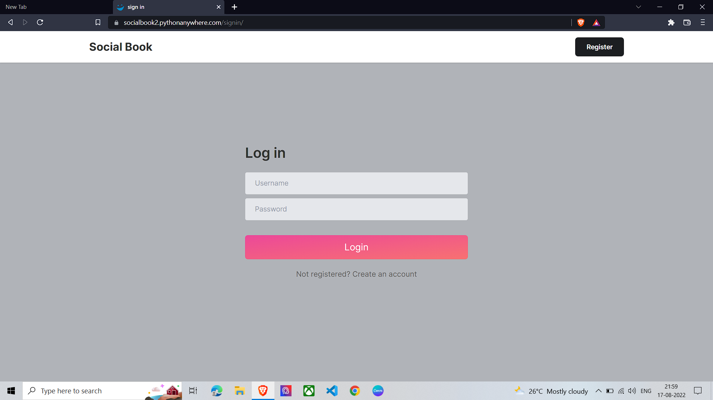
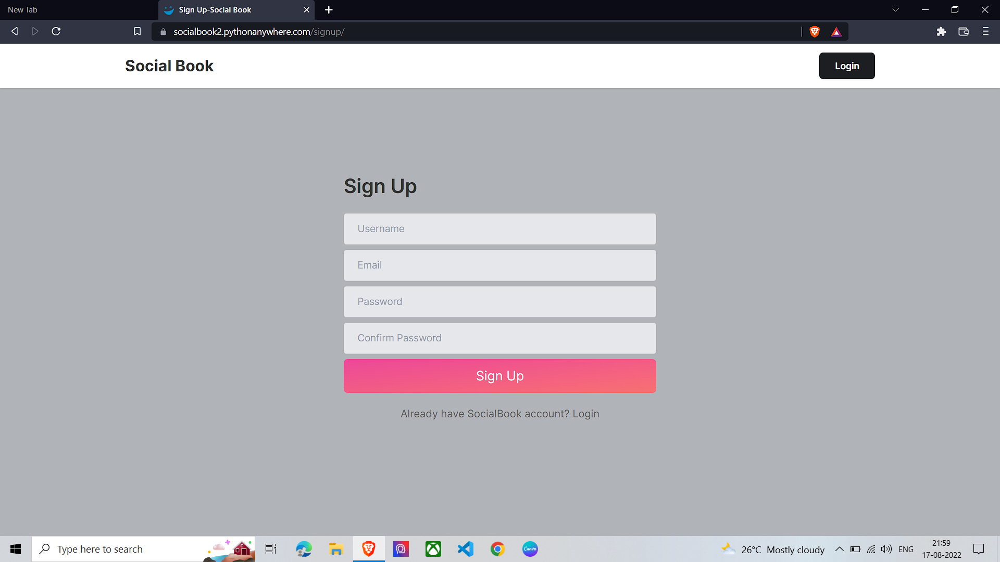
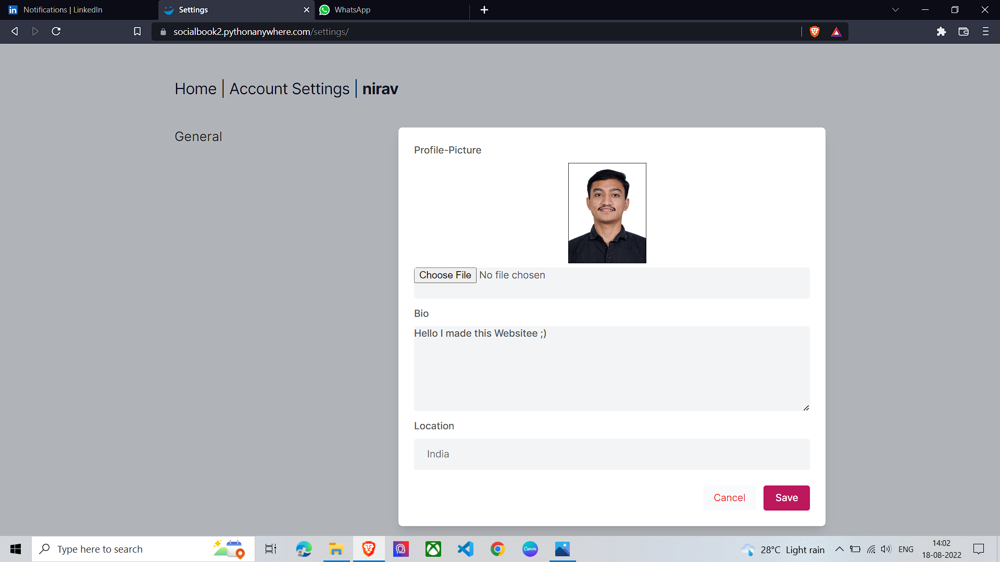
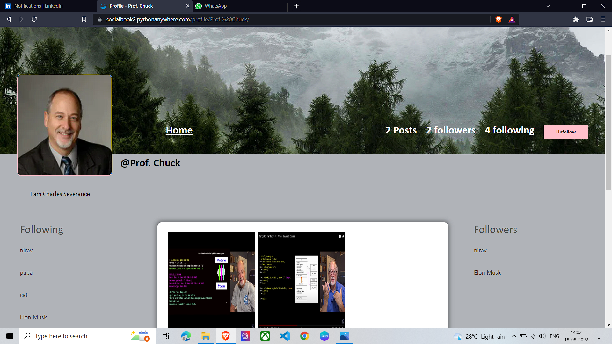
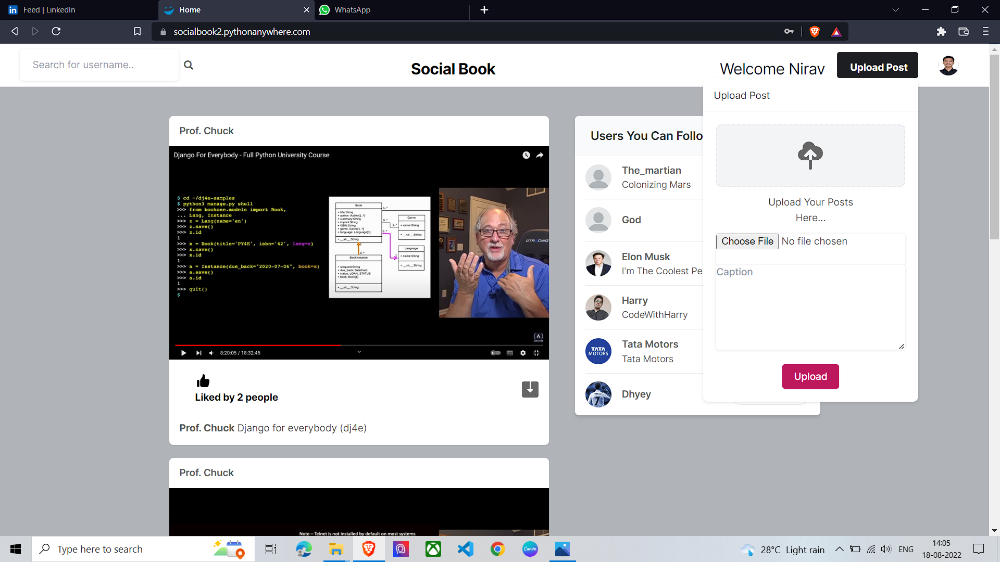
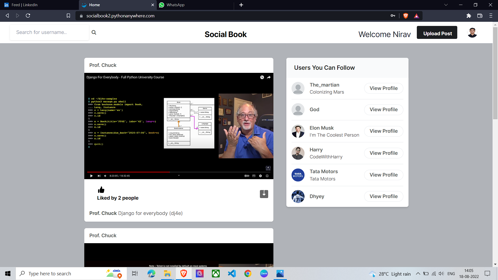
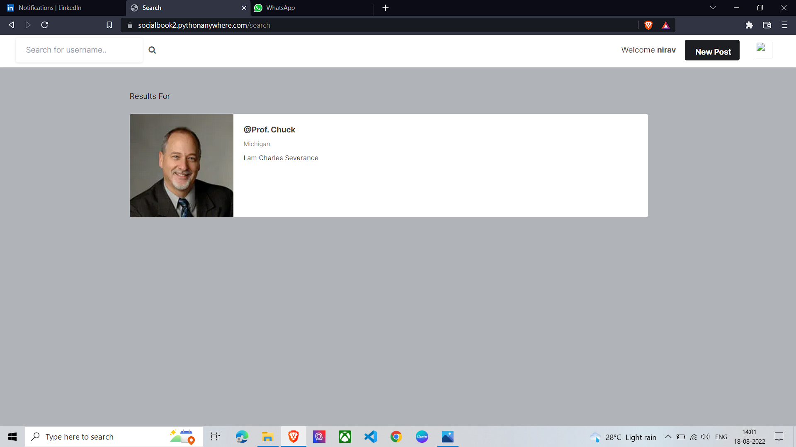

# Social Book
### Website Link: [socialbook2.pythonanywhere.com](https://socialbook2.pythonanywhere.com/signin/?next=/)
## Installation Guide:
Download code from Repository
1. Install virtualenv:

`pip install virtualenv`

2. Create virtualenv:

`virtualenv name_of_virtualenv`

3. Activate virtualenv:

`.\name_of_virtualenv\Scripts\activate.ps1`

4. Install required modules:

`pip install -r requirements.txt`

5. Run project on LocalHost:

`python manage.py runserver`

## Project Features:
Note: Some of the accounts like Prof. Chuck, Elon Musk, Harry and Tata Motors shown in the images are created by me just for setting examples.
1. LogIn/SignUp to the website.

2. Create your own profile and upload Profile Picture.

3. Follow/Unfollow other users, see their profiles, see their followers and the people they follow.

4. Upload posts.

5. See and Like posts of the users you follow.

6. Search a user by their username.

7. See the list of people you can follow.

### Feel free to contribute by raising an issue or creating a pull request.
